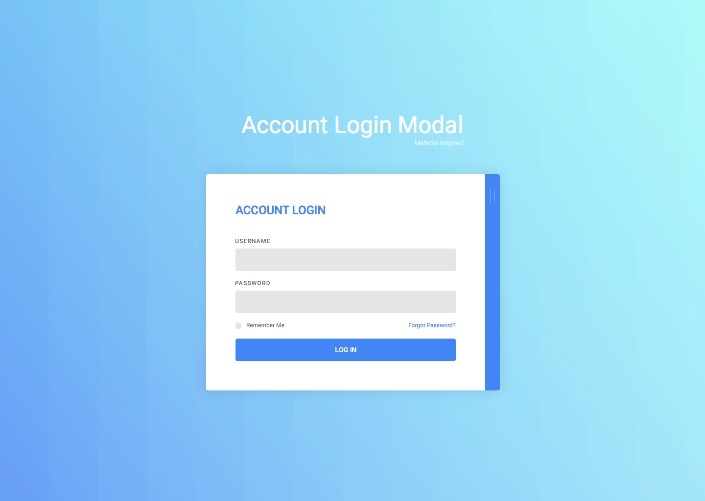

# Account Login Modal

This is a material inspired login modal with 2 panels. A login panel, and a registration panel which is hidden by default. The registration panel can be triggered by clicking the visible tab on the right side. Once clicked, the registration panel will slide in and overlap the login panel.

#### Requirements
* [Node.js](http://nodejs.org/)
* [GruntJS](http://gruntjs.com/)
* [Git](https://git-scm.com/book/en/v2/Getting-Started-Installing-Git)

-

#### Step 1: Installing Node.js
The first step is getting NodeJS installed. If you already have it installed go ahead and skip to step [#2](#step-2-installing-gruntjs).

1. Head over to `https://nodejs.org/en/` and install the latest version of Node.js
2. Now that it's installed, run `node -v` to verify that you have the latest version installed.
3. Head over to step [#2](#step-2-installing-gruntjs).

-

#### Step 2: Installing GruntJS
The next step is setting up GruntJS locally. If you already have it installed go ahead and skip to step [#3](#step-3-installing-git).

1. Now that you have Node installed, let's install GruntJS by running the following command: `npm install -g grunt-cli`.
2. Head over to step [#3](#step-3-installing-git).

-

#### Step 3: Installing Git
After installing Node and Grunt, you can now install Git. If you already have it installed go ahead and skip to step [#4](#step-4-cloning-repo).

1. Go to `https://git-scm.com/book/en/v2/Getting-Started-Installing-Git` and follow the to installing git for the correct machine.
2. Head over to step [#4](#step-4-cloning-repo).

-

#### Step 4: Cloning Repo
1. With everything installed, you can now clone the repo using the following command: `git clone git@github.com:andyhqtran/UI-Library.git`.
2. Now with the repo cloned, you can navigate to it using the following command: `cd UI-Library/Login\ Form/`.
3. Head over to step [#5](#step-5-installing-packages).

-

#### Step 5: Installing Packages
1. From current directory, install node packages with the following command: `npm install`.
2. Head over to step [#6](#step-6-running-grunt).

-

#### Step 6: Running Grunt
1. From the current directory, run the following command: `grunt build`. This will compile the Jade and Scss files.
2. Once everything is compiled, you can run the local server with the following command: `grunt`.
3. With grunt running, you can head over to `localhost:3000` to view the `login modal`.