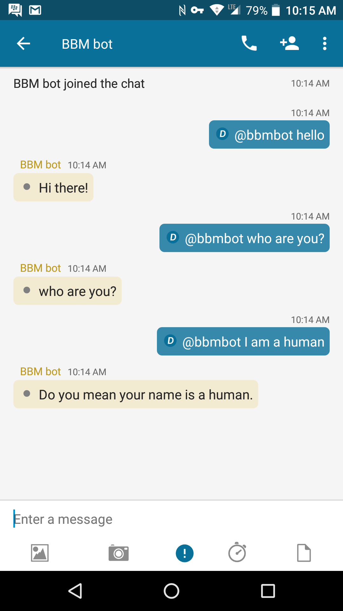

# BBMBot

The BBMBot provides an example of how to write a bot in Node.js which can send messages to, and receive messages from, other BBM Enterprise SDK clients. It uses the botlibre (www.botlibre.com) webservice as an example of how to generate responses.

## Screenshots

[](screenShots/BBMBot_chat.png)

## Features

With the BBMBot example, your app can do the following:

- Invite the bot to a 1:1 or multi-person chat.
- In a 1:1 chat, write to the bot, and the bot will respond.
- In a multi-person chat, the bot will respond only to messages which begin with "@bbmbot".

## <a name="prereq"></a>Prerequisites

Visit the [Getting Started with Node](../../gettingStarted-node.md) section to see the minimum requirements.

To use the BBMBot example, you must set up the following elements in config.js:

-client_id: The Google client id
-client_secret: The Google client secret

The Google client id and secret can be generated by going to the Google API console: https://console.developers.google.com and choosing:
#Credentials
#Create Credentials
#OAuth client ID
#Web application
#Create

-id_provider_domain: The BBM Enterprise domain provided when signing up for BBM Enterprise

-firebaseConfig: The firebase API config.

The firebase API config can be generated from the Firebase console: https://console.firebase.google.com

Create a project, then choose 'Add Firebase to your web app'.

-botLibre: The botlibre configuration.

The bot uses the botlibre chatbot service to provide responses to messages. An account can be created by going to https://botlibre.com

The bot can be created by choosing:
#Sign up (and complete sign up procedure)
#Create (and fill in bot information)

Then choose 'Embed' and copy the application and instance information.

## <a name="running"></a>Running

The app can be started with:

```shell
node BBMBot
```
