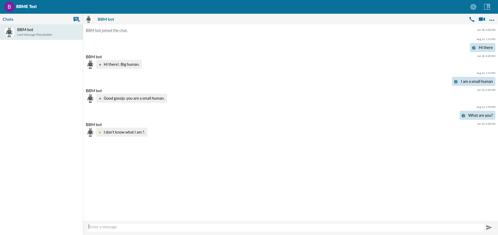
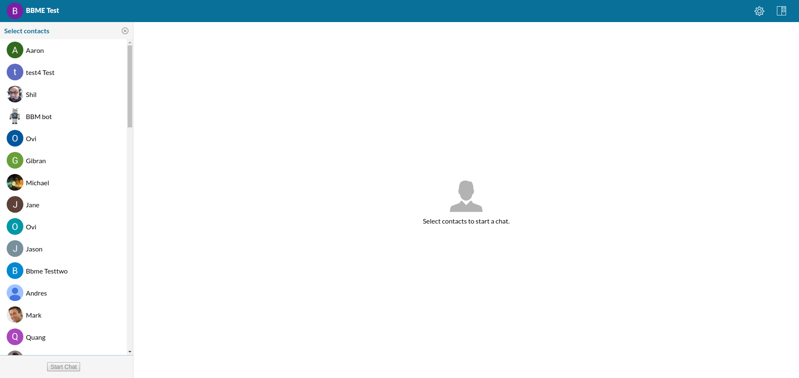

# RichChat 

The RichChat application is an in-depth & feature rich example that shows how to use BBM Enterprise SDK for Web in an application setting. RichChat can be used as-is, or you can modify the RichChat example to gain a better understanding of the BBM Enterprise SDK for Web.

Note: To use the RichChat example, you must complete the setup steps in the [Prerequisites](#prereq) section.

## Screenshots

 

## Features

With the RichChat example, your app can do the following:

- Create a chat
- View the chat list
- View all sent and received messages in a chat
- Send a message, picture, or file attachment
- Make a voice or video call
- View a list of users, and start a chat with any other user

## Prerequisites

Visit the [Getting Started with Web](../../gettingStarted-web.md) section to see the minimum requirements.

To use the RichChat example, you must set up the following elements in js/config.js:

- Google client ID (GOOGLE_CLIENT_ID)
- Your BBM Enterprise SDK user domain (ID_PROVIDER_DOMAIN).
