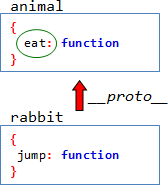
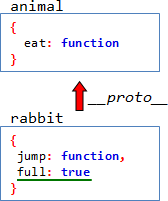

**Ответ: свойство будет записано в `rabbit`.**

Если коротко -- то потому что `this` будет указывать на `rabbit`, а прототип при записи не используется.

Если в деталях -- посмотрим как выполняется `rabbit.eat()`:

1. Интерпретатор ищет `rabbit.eat`, чтобы его вызвать. Но свойство `eat` отсутствует в объекте `rabbit`, поэтому он идет по ссылке `rabbit.__proto__` и находит это свойство там.

2. Функция `eat` запускается. Контекст ставится равным объекту перед точкой, т.е. `this = rabbit`.

    Итак -- получается, что команда `this.full = true` устанавливает свойство `full` в самом объекте `rabbit`. Итог:

    

Эта задача демонстрирует, что несмотря на то, в каком прототипе находится свойство, это никак не влияет на установку `this`, которая осуществляется по своим, независимым правилам.