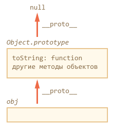
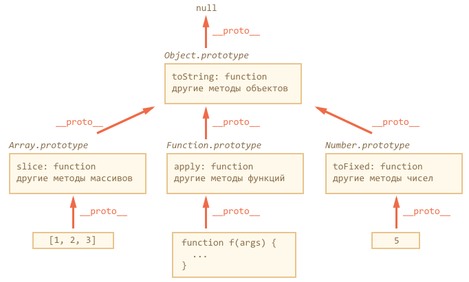
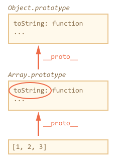

# Встроенные "классы" в JavaScript

В JavaScript есть встроенные объекты: `Date`, `Array`, `Object` и другие. Они используют прототипы и демонстрируют организацию "псевдоклассов" на JavaScript, которую мы вполне можем применить и для себя.

[cut]

## Откуда методы у {} ?

Начнём мы с того, что создадим пустой объект и выведем его.

```js run
var obj = {};
alert( obj ); // "[object Object]" ?
```

Где код, который генерирует строковое представление для `alert(obj)`? Объект-то ведь пустой.

## Object.prototype

...Конечно же, это сделал метод `toString`, который находится... Конечно, не в самом объекте (он пуст), а в его прототипе `obj.__proto__`, можно его даже вывести:

```js run
alert( {}.__proto__.toString ); // function toString
```

Откуда новый объект `obj` получает такой `__proto__`?

1. Запись `obj = {}` является краткой формой `obj = new Object`, где `Object` -- встроенная функция-конструктор для объектов.
2. При выполнении `new Object`, создаваемому объекту ставится `__proto__` по `prototype` конструктора, который в данном случае равен встроенному `Object.prototype`.
3. В дальнейшем при обращении к `obj.toString()` -- функция будет взята из `Object.prototype`.



Это можно легко проверить:

```js run
var obj = {};

// метод берётся из прототипа?
alert( obj.toString == Object.prototype.toString ); // true, да

// проверим, правда ли что __proto__ это Object.prototype?
alert( obj.__proto__ == Object.prototype ); // true

// А есть ли __proto__ у Object.prototype?
alert( obj.__proto__.__proto__ ); // null, нет
```

## Встроенные "классы" в JavaScript

Точно такой же подход используется в массивах `Array`, функциях `Function` и других объектах. Встроенные методы для них находятся в `Array.prototype`, `Function.prototype` и т.п.



Например, когда мы создаём массив, `[1, 2, 3]`, то это альтернативный вариант синтаксиса `new Array`, так что у массивов есть стандартный прототип `Array.prototype`.

Но в нём есть методы лишь для массивов, а для общих методов всех объектов есть ссылка `Array.prototype.__proto__`, равная `Object.prototype`.

Аналогично, для функций.

Лишь для чисел (как и других примитивов) всё немного иначе, но об этом чуть далее.

Объект `Object.prototype` -- вершина иерархии, единственный, у которого `__proto__` равно `null`.

**Поэтому говорят, что "все объекты наследуют от `Object`", а если более точно, то от `Object.prototype`.**

"Псевдоклассом" или, более коротко, "классом", называют функцию-конструктор вместе с её `prototype`. Такой способ объявления классов называют "прототипным стилем ООП".

При наследовании часть методов переопределяется, например, у массива `Array` есть свой `toString`, который выводит элементы массива через запятую:

```js run
var arr = [1, 2, 3]
alert( arr ); // 1,2,3 <-- результат Array.prototype.toString
```

Как мы видели раньше, у `Object.prototype` есть свой `toString`, но так как в `Array.prototype` он ищется первым, то берётся именно вариант для массивов:



````smart header="Вызов методов через `call` и `apply` из прототипа"
Ранее мы говорили о применении методов массивов к "псевдомассивам", например, можно использовать `[].join` для `arguments`:

```js run
function showList() {
*!*
  alert( [].join.call(arguments, " - ") );
*/!*
}

showList("Вася", "Паша", "Маша"); // Вася - Паша - Маша
```

Так как метод `join` находится в `Array.prototype`, то можно вызвать его оттуда напрямую, вот так:

```js run
function showList() {
*!*
  alert( Array.prototype.join.call(arguments, " - ") );
*/!*
}

showList("Вася", "Паша", "Маша"); // Вася - Паша - Маша
```

Это эффективнее, потому что не создаётся лишний объект массива `[]`, хотя, с другой стороны -- больше букв писать.
````

## Примитивы

Примитивы не являются объектами, но методы берут из соответствующих прототипов: `Number.prototype`, `Boolean.prototype`, `String.prototype`.

По стандарту, если обратиться к свойству числа, строки или логического значения, то будет создан объект соответствующего типа, например `new String` для строки, `new Number` для чисел, `new Boolean` -- для логических выражений.

Далее будет произведена операция со свойством или вызов метода по обычным правилам, с поиском в прототипе, а затем этот объект будет уничтожен.

Именно так работает код ниже:

```js run
var user = "Вася"; // создали строку (примитив)

*!*
alert( user.toUpperCase() ); // ВАСЯ
// был создан временный объект new String
// вызван метод
// new String уничтожен, результат возвращён
*/!*
```

Можно даже попробовать записать в этот временный объект свойство:

```js run
// попытаемся записать свойство в строку:
var user = "Вася";
user.age = 30;

*!*
alert( user.age ); // undefined
*/!*
```

Свойство `age` было записано во временный объект, который был тут же уничтожен, так что смысла в такой записи немного.

````warn header="Конструкторы `String/Number/Boolean` -- только для внутреннего использования"
Технически, можно создавать объекты для примитивов и вручную, например `new Number`. Но в ряде случаев получится откровенно бредовое поведение. Например:

```js run
alert( typeof 1 ); // "number"

alert( typeof new Number(1) ); // "object" ?!?
```

Или, ещё страннее:

```js run
var zero = new Number(0);

if (zero) { // объект - true, так что alert выполнится
  alert( "число ноль -- true?!?" );
}
```

Поэтому в явном виде `new String`, `new Number` и `new Boolean` никогда не вызываются.
````

```warn header="Значения `null` и `undefined` не имеют свойств"
Значения `null` и `undefined` стоят особняком. Вышесказанное к ним не относится.

Для них нет соответствующих классов, в них нельзя записать свойство (будет ошибка), в общем, на конкурсе "самое примитивное значение" они точно разделили бы первое место.
```

## Изменение встроенных прототипов [#native-prototype-change]

Встроенные прототипы можно изменять. В том числе -- добавлять свои методы.

Мы можем написать метод для многократного повторения строки, и он тут же станет доступным для всех строк:

```js run
String.prototype.repeat = function(times) {
  return new Array(times + 1).join(this);
};

alert( "ля".repeat(3) ); // ляляля
```

Аналогично мы могли бы создать метод `Object.prototype.each(func)`, который будет применять `func` к каждому свойству:

```js run
Object.prototype.each = function(f) {
  for (var prop in this) {
    var value = this[prop];
    f.call(value, prop, value); // вызовет f(prop, value), this=value
  }
}

// Попробуем! (внимание, пока что это работает неверно!)
var user = {
  name: 'Вася',
  age: 25
};

user.each(function(prop, val) {
  alert( prop ); // name -> age -> (!) each
});
```

Обратите внимание -- пример выше работает не совсем корректно. Вместе со свойствами объекта `user` он выводит и наше свойство `each`. Технически, это правильно, так как цикл `for..in` перебирает свойства и в прототипе тоже, но не очень удобно.

Конечно, это легко поправить добавлением проверки `hasOwnProperty`:

```js run
Object.prototype.each = function(f) {

  for (var prop in this) {

*!*
    // пропускать свойства из прототипа
    if (!this.hasOwnProperty(prop)) continue;
*/!*

    var value = this[prop];
    f.call(value, prop, value);

  }

};

// Теперь все будет в порядке
var obj = {
  name: 'Вася',
  age: 25
};

obj.each(function(prop, val) {
  alert( prop ); // name -> age
});
```

Здесь это сработало, теперь код работает верно. Но мы же не хотим добавлять  `hasOwnProperty` в цикл по любому объекту! Поэтому либо не добавляйте свойства в `Object.prototype`, либо можно использовать [дескриптор свойства](/descriptors-getters-setters) и флаг `enumerable`.

Это, конечно, не будет работать в IE8-:

```js run
Object.prototype.each = function(f) {

  for (var prop in this) {
    var value = this[prop];
    f.call(value, prop, value);
  }

};

*!*
// поправить объявление свойства, установив флаг enumerable: false
Object.defineProperty(Object.prototype, 'each', {
  enumerable: false
});
*/!*

// Теперь все будет в порядке
var obj = {
  name: 'Вася',
  age: 25
};

obj.each(function(prop, val) {
  alert( prop ); // name -> age
});
```

Есть несколько "за" и "против" модификации встроенных прототипов:

```compare
+ Методы в прототипе автоматически доступны везде, их вызов прост и красив.
- Новые свойства, добавленные в прототип из разных мест, могут конфликтовать между собой. Представьте, что вы подключили две библиотеки, которые добавили одно и то же свойство в прототип, но определили его по-разному. Конфликт неизбежен.
- Изменения встроенных прототипов влияют глобально, на все-все скрипты, делать их не очень хорошо с архитектурной точки зрения.
```

Как правило, минусы весомее, но есть одно исключение, когда изменения встроенных прототипов не только разрешены, но и приветствуются.

**Допустимо изменение прототипа встроенных объектов, которое добавляет поддержку метода из современных стандартов в те браузеры, где её пока нет.**

Например, добавим `Object.create(proto)` в старые браузеры:

```js
if (!Object.create) {

  Object.create = function(proto) {
    function F() {}
    F.prototype = proto;
    return new F;
  };

}
```

Именно так работает библиотека [es5-shim](https://github.com/kriskowal/es5-shim), которая предоставляет многие функции современного JavaScript для старых браузеров. Они добавляются во встроенные объекты и их прототипы.

## Итого

- Методы встроенных объектов хранятся в их прототипах.
- Встроенные прототипы можно расширить или поменять.
- Добавление методов в `Object.prototype`, если оно не сопровождается `Object.defineProperty` с установкой `enumerable` (IE9+), "сломает" циклы `for..in`, поэтому стараются в этот прототип методы не добавлять.

    Другие прототипы изменять менее опасно, но все же не рекомендуется во избежание конфликтов.

    Отдельно стоит изменение с целью добавления современных методов в старые браузеры, таких как <a href="https://developer.mozilla.org/en/JavaScript/Reference/Global_Objects/Object/create">Object.create</a>, <a href="https://developer.mozilla.org/en/JavaScript/Reference/Global_Objects/Object/keys">Object.keys</a>, <a href="https://developer.mozilla.org/en/JavaScript/Reference/Global_Objects/Function/bind">Function.prototype.bind</a> и т.п. Это допустимо и как раз делается [es5-shim](https://github.com/kriskowal/es5-shim).

