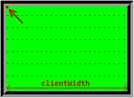

При абсолютном позиционировании мяча внутри поля его координаты `left/top` отсчитываются от **внутреннего** угла поля, например верхнего-левого:



Метрики для внутренней зоны поля -- это `clientWidth/Height`.

Центр - это `(clientWidth/2, clientHeight/2)`.

Но если мы установим мячу такие значения `ball.style.left/top`, то в центре будет не сам мяч, а его левый верхний угол:

```js
var ball = document.getElementById('ball');
var field = document.getElementById('field');

ball.style.left = Math.round(field.clientWidth / 2) + 'px';
ball.style.top = Math.round(field.clientHeight / 2) + 'px';
```

[iframe hide="Нажмите, чтобы посмотреть текущий результат" height=180 src="ball-half"]

Для того, чтобы центр мяча находился в центре поля, нам нужно сместить мяч на половину его ширины влево и на половину его высоты вверх.

```js
var ball = document.getElementById('ball');
var field = document.getElementById('field');

ball.style.left = Math.round(field.clientWidth / 2 - ball.offsetWidth / 2) + 'px';
ball.style.top = Math.round(field.clientHeight / 2 - ball.offsetHeight / 2) + 'px';
```

**Внимание, подводный камень!**

Код выше стабильно работать не будет, потому что `IMG` идет без ширины/высоты:

```html

```

**Высота и ширина изображения неизвестны браузеру до тех пор, пока оно не загрузится, если размер не указан явно.**

После первой загрузки изображение уже будет в кеше браузера, и его размеры будут известны. Но когда браузер впервые видит документ -- он ничего не знает о картинке, поэтому значение `ball.offsetWidth` равно `0`. Вычислить координаты невозможно.

Чтобы это исправить, добавим `width/height` к картинке:

```html

```

Теперь браузер всегда знает ширину и высоту, так что все работает. Тот же эффект дало бы указание размеров в CSS.

