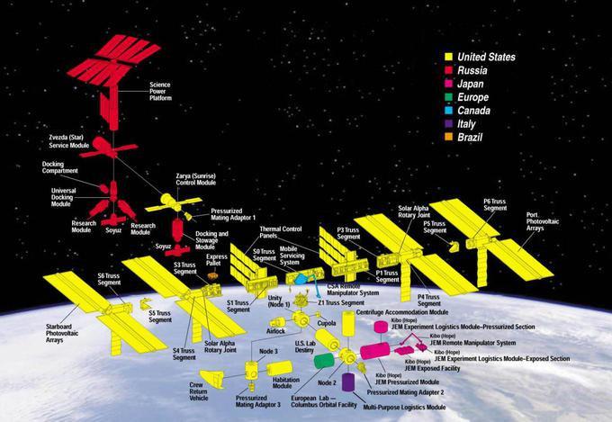

# С высоты орбитального полёта

Этот раздел посвящён набору современных браузерных стандартов, описывающих создание "веб-компонент" (web components).

На текущий момент эти стандарты -- в разработке, браузеры по-разному поспевают за их развитием. Статьи можно читать в любом браузере, но для тестирования я бы рекомендовал использовать Chrome Canary, поскольку главной "движущей силой" этих стандартов являются сотрудники Google и, как правило, этот браузер реализует последний вариант спецификации.

Понимание этих стандартов важно потому, что это "взгляд в будущее", в то, какой станет интернет-разработка. Сейчас уже существуют некоторые полифиллы, частично реализующие их.

Идеи веб-компонент взяты не с пустого места. Они эксплуатируются в более "приземлённых", текущих подходах к разработке.

## Что общего, между...

Прежде, чем мы перейдём к веб-компонентам, посмотрим на одну очень классную штуку:


Да, это Международная Космическая Станция (МКС).

И вот, как она, приблизительно, устроена:



МКС:

- Состоит из множества компонентов.
- Каждый компонент -- в свою очередь состоит из множества деталей внутри.
- Эти компоненты очень сложны, они гораздо сложнее, чем большинство сайтов.
- Их разрабатывают команды из разных стран, разговаривающие на разных языках.

...И эта штука летает!

За счёт чего строятся настолько сложные вещи?

Что мы могли бы позаимствовать, чтобы наша разработка была столь же надёжной и масштабируемой? Ну, или по крайней мере, близко к этому...

## Компонентная архитектура

Ключевое правило при разработке сложных вещей: "Никогда не делайте сложные вещи".

Если что-то становится сложным -- разбиваем это на части попроще и связываем их наиболее очевидным способом.

**Хороший архитектор -- это как раз тот, кто умеет делать сложное простым.**

Любой сложный интерфейс мы делим на компоненты -- сущности, для которых мы можем максимально чётко и понятно указать, что это такое и что оно умеет делать.

Посмотрим на какой-нибудь более-менее сложный сайт, например на [Twitter](https://twitter.com).

Он естественным образом распадается на компоненты:


Для наглядности они обведены <span style="border: 2px dashed red">красной рамкой:</span>

1. "Главное Меню"
2. "Об Авторе"
3. "Близкие по духу"
4. "Твиты"

Как мы решаем, что именно выделять в компонент? Это нам подсказывает опыт и здравый смысл.

В случае с твиттером разбиение на компоненты особенно очевидно. Страница "сама распадается" на чётко очерченные блоки, каждый из которых выполняет свою роль.

Если представить каждый компонент HTML-тегом, то страница будет выглядеть примерно так (выделены нестандартные теги):

```html
<header>
*!*
  <top-menu/>
*/!*
</header>
<aside>
*!*
  <author-info/>
  <congenial-info/>
*/!*
</aside>
<main>
*!*
  <tweets-list/>
*/!*
</main>
```

До недавнего времени, чтобы так описать страницу, требовались специальные JavaScript-фреймворки. Такой фреймворк позволял описывать "свои" теги, которые, после обработки фреймворком, становились JavaScript-объектами.

Веб-компоненты (Web Components) -- это не один стандарт, а целая платформа, комплекс стандартов, которые вместе добавляют в браузер технологии для удобной реализации компонент.

Если глядеть "сверху", то веб-компоненты -- это возможность добавлять свои элементы в браузер, например `document.createElement("tweets-list")`, которые описываются с помощью классов JavaScript, могут иметь свои методы и свойства.

Также "под капотом" кроются расширенные возможности по инкапсуляции поддерева DOM и стилей, по генерации событий и многое другое, что мы рассмотрим далее.

