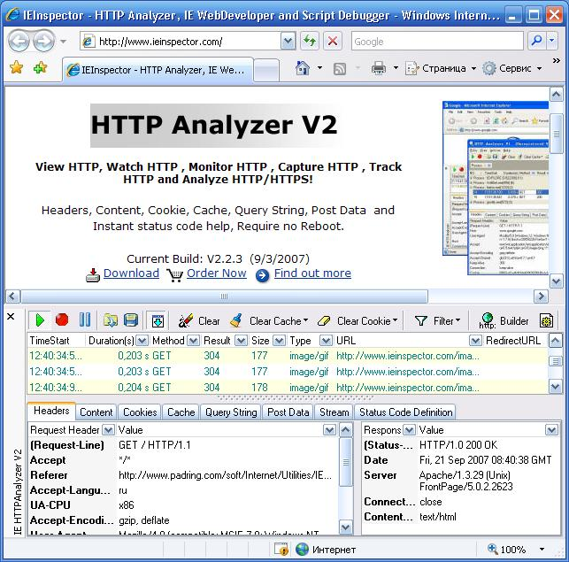

# IE HTTP Analyzer

Под Windows есть как минимум два весьма основных инструмента для отладки на уровне HTTP.

Один из них -- Fiddler. Другой -- IE HTTP Analyzer, который представляет собой "другой угол зрения" на задачу.

[cut]

## Возможности
IE HTTP Analyzer -- платный, и имеет две ипостаси.

Первая - это обычная программа, запущенная в отдельном окне. При нажатии на кнопку "Play" - начинает перехват HTTP для всех браузеров, включая Firefox.

Вторая -- наподобие Firebug, раскрывающаяся полоса внизу браузера Internet Explorer. Это -- плагин, вызывается из панели или меню браузера.

Существуют другие программы похожего вида, но, перебрав несколько, я остановился на этой, как самой удобной.

Основные возможности сводятся к удобной отладке HTTP-запросов, да и кнопочки на скриншотах выше достаточно очевидны.

## Просмотр и создание HTTP-запросов.
Этим сейчас никого не удивишь, если бы не одно БОЛЬШОЕ НО.

Программа дает возможность удобно просматривать потоковые запросы.

Т.е, например,  отлаживаете Вы чат. А он держит непрерывный iframe, через который сервер передает данные. Программы типа Fiddler будут честно ждать конца запроса, чтобы показать Вам его, а IE HTTP Analyzer не менее честно будет сбрасывать поток пред Ваши светлы очи.

Запросы могут поступать все новые и новые, но в панели инспектора есть кнопка , которая управляет автопереходом к следующему запросу. При анализе потока она должна быть выключена.

Эта "потоковость" IE Http Analyzer- один из важных его плюсов.

## Конструирование фильтров

В отличие от правил на языке JScript.NET, которые используются для фильтрации в Fiddler, здесь фильтры на интересующие Вас запросы можно конструировать из стандартных компонент, объединяя их условиями ИЛИ/И.

## Дополнительные возможности
Очистка куков и кеша браузера. Проверено, работает.

Программа платная.

Живет на <a href="http://www.ieinspector.com/httpanalyzer/">http://www.ieinspector.com/httpanalyzer/</a>.