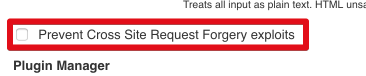

# jenkins-rest-api

Jenkins Java Rest API Module  

## 목적

특정 비지니스 로직 사이에 젠킨스 Job을 사용해야할때가 있습니다.  
어플리케이션에서 젠킨스 Job을 구동시킬수 있는 모듈입니다. 

## 사용방법

### 주의사항

혹시나 403이 발생하는 분들은 젠킨스의 CORS 문제때문입니다.  
젠킨스의 Global Security에서 CORS 체크박스를 해제해야만 사용가능합니다.  



### Job Parameter 없을 경우

```java
RequestEntity requestEntity = new RequestEntity(HOST, JOB, USERNAME, TOKEN);
JenkinsConnector jenkinsConnector = new JenkinsConnector();

jenkinsConnector.executeJob(requestEntity);
```

### Job Parameter 있을 경우

```java
RequestEntity requestEntity = new RequestEntity(HOST, JOB, USERNAME, TOKEN);
requestEntity.add(new NameValue("name", "jojoldu"));
requestEntity.add(new NameValue("email", "jojoldu@gmail.com"));

JenkinsConnector jenkinsConnector = new JenkinsConnector();

jenkinsConnector.executeJob(requestEntity);
```

```JenkinsConnector```의 경우 Bean으로 등록하여 사용하면 더 효과적