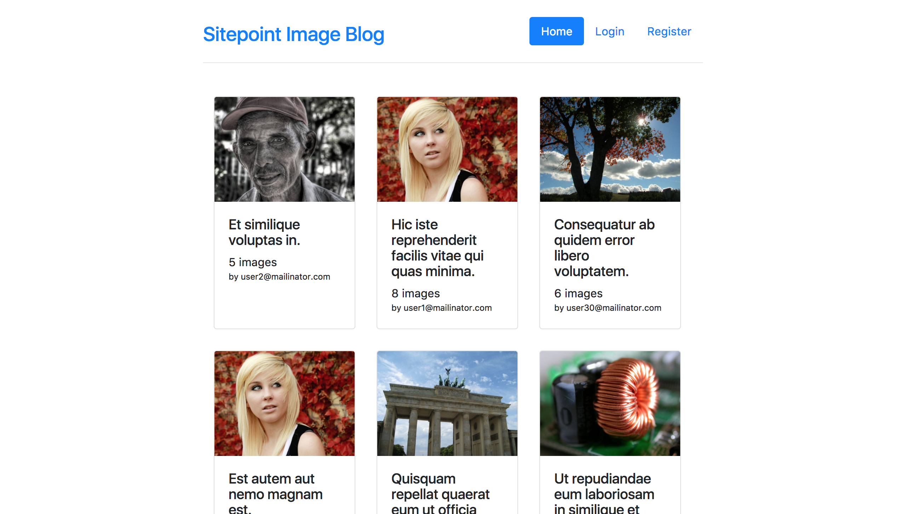

# Bootstrapping a New Project

Now and then you have to create a new project repository, run that `git init` command locally and kickoff a new awesome project. 
I have to admit I like the feeling of starting something new; it's like going on an adventure!

Lao Tzu said:
> The journey of a thousand miles begins with one step

We can think about the project setup as the very first step of our thousand miles (users!) journey. We aren't sure where exactly
we are going to end, but it will be fun! 

We also should keep in mind advice from prof. Donald Knuth:

> Premature optimization is the root of all evil (or at least most of it) in programming.

Our journey towards stable and robust, high-performance web app will start with the simple but functional application.
We will populate the database with random content, do some benchmarks and improve performances incrementally. Every article
in this series will be a checkpoint on our journey! 

This article will cover basics of setting up the project and organizing files for Symfony Flex project. 
I will also show you some tips, tricks and helper scripts I'm using for speeding up the development.
 
## First things first, What are we creating anyways?

Before starting any project, you should have a clear vision of the final destination.
Where are you headed? Who will be using your app and how? What are the main features you're building? 
Once you have that set, you can prepare your environment, 3rd party libraries and dive in developing the next big thing.

In this series of articles, we'll be building simple image gallery blog where users can register or log in, 
upload images and create simple image galleries with descriptions written in markdown format. 

We'll be using new [Symfony Flex](https://www.sitepoint.com/symfony-flex-paving-path-faster-better-symfony/) and 
[Homestead](https://www.sitepoint.com/quick-tip-get-homestead-vagrant-vm-running/) 
(make sure you've read tutorials on them as we're not going to cover it here). 
All the code referenced in the article is available at [GitHub repo](https://github.com/zantolov/multi-image-gallery-blog).

We are going to use Twig templating engine, Symfony forms, and Doctrine ORM with UUIDs as primary keys. 
Entities and routes will use annotations; we'll have simple [email/password based authentication](http://symfony.com/doc/current/security/form_login_setup.html), 
and we will prepare data fixtures to populate the database.

After creating new project based on `symfony/skeleton` by executing command 

```
composer create-project "symfony/skeleton:^3.3" multi-user-gallery-blog
```

we can require additional packages (some of them are referenced by their aliases, new feature brought by Flex):

``` 
composer req annotations security orm template asset validator ramsey/uuid-doctrine
```

Dependencies used only in the dev environment are required with `--dev` flag:

```
composer req --dev fzaninotto/faker doctrine/Doctrine-Fixtures-Bundle
```

Because of some of our dependencies we have to set minimum stability to `dev` in our `composer.json`.

Flex is doing some serious work for us behind the scenes, and most of the libraries (or bundles) are already registered and configured
with good-enough defaults! Check `config` directory for yourself. You can check all dependencies used in this project
in [composer.json](https://github.com/zantolov/multi-image-gallery-blog/blob/master/composer.json) file.

Routes are defined by annotations so we need to add following code to our `config/routes.yaml`: 

```
controllers:
    resource: ../src/Controller/
    type: annotation
```

## Database, Scripts, and Fixtures

Configure `DATABASE_URL` environment variable (e.g. by editing `.env` file) to setup working DB connection. 
DB schema can be generated from existing entities by executing:

```
./bin/console doctrine:schema:create
```

If everything is OK, you should be able to see freshly created tables in the database
(for [Gallery](https://github.com/zantolov/multi-image-gallery-blog/blob/master/src/Entity/Gallery.php), 
[Image](https://github.com/zantolov/multi-image-gallery-blog/blob/master/src/Entity/Image.php) and 
[User](https://github.com/zantolov/multi-image-gallery-blog/blob/master/src/Entity/User.php) entities).

If you want to drop database schema you can run: 

```
./bin/console doctrine:schema:drop --full-database --force
```

### Fake it until you make it!

I can't imagine developing an app today without having data fixtures (i.e., scripts for seeding the DB). 
With few simple scripts, you can populate your database with realistic content, which is useful
when it comes to rapid app development and testing, but it's also a requirement for a healthy CI pipeline. 

I find [Doctrine Fixtures Bundle](https://symfony.com/doc/master/bundles/DoctrineFixturesBundle/index.html) excellent 
tool for handling data fixtures as it supports ordered fixtures (i.e., you can control the order of execution), 
sharing objects (via references) between scripts and accessing service container. 

Default Symfony services configuration doesn't allow public access to services as best practice is to inject all dependencies.
We'll need some services in our fixtures so I'm going to make all services in `App\Services` publicly available by adding:

```
    App\Service\:
        resource: '../src/Service/*'
        public: true
```

to `config/services.yaml`.

I'm also using [Faker](https://github.com/fzaninotto/Faker) to get random but realistic data (names, sentences, texts, images, addresses, ... ). 
Take a look at the [script for seeding galleries ](https://github.com/zantolov/multi-image-gallery-blog/blob/master/src/DataFixtures/ORM/LoadGalleriesData.php) 
with random images to get a feeling how cool this combination is.

Usually, I combine commands for dropping existing DB schema, creating new DB schema, loading data 
fixtures and other repetitive tasks in a single shell script e.g. `bin/refreshDb.sh` so I can easily 
re-generate DB schema and load dummy data:

```
# Drop schema
./bin/console doctrine:schema:drop --full-database --force

# Create schema
./bin/console doctrine:schema:create

# Load fixtures
./bin/console doctrine:fixtures:load -n --fixtures src/DataFixtures/ORM

# Install assets
./bin/console assets:install --symlink

# Clear cache
./bin/console cache:clear
```

Make sure you restrict execution of this script on production, or you are going to have serious fun at some point.

After executing `bin/refreshDb.sh` you should be able to see the homepage of our blog:


 
 *Project homepage after fixtures are loaded*

One can argue that randomly generated data can't reproduce different edge cases so your CI can sometimes fail or pass
depending on the data generation. It is true, and you should make sure all edge cases are covered with your fixtures.
Every time you find an edge case causing a bug, make sure you add it to data fixtures. This will help you to build 
more robust system and prevent similar errors in the future.

## Controllers, Templates and Services

Controller classes are located under `src\Controller` directory and are not extending existing `Controller` class provided by
`FrameworkBundle`. 
All dependencies are injected through constructor making the code less coupled and easier to test.
I don't like 'magic' for simple stuff!

In the new Symfony directory structure, templates are located under `templates` directory. 
I've created master template `base.html.twig` that defines basic HTML structure and references external resources.
Other templates are extending it and overriding its blocks (e.g. stylesheets, body, header, content, javascripts and other blocks).
Local assets are referenced by using `asset` Twig function as it will enable us better control later (e.g. changing hosts and appending query strings for versioning).
Other templates are organized in subdirectories within `src/templates` directory. 

Services are automatically registered and configured by default Symfony service configuration. 
That way it isn't needed to manually configure Twig extensions with filters for markdown support and generating URL 
for Image entity located under `src/Twig` directory.

## Source Code Management / Version Control 

Hopefully, you already know about [Git basics](https://www.sitepoint.com/git-for-beginners/) and understand how `.gitignore` works.

Symfony Flex manages default project `.gitignore` by adding known bundle files and folders to the ignore list. For example,
Flex would add following files to the ignore list for `symfony/framework-bundle` bundle: 

```
.env
/public/bundles/
/var/
/vendor/
```

We are going to store uploaded files in `var/uploads` so we need it created first.
Instead of doing it manually on every project setup, we can add command for creating all needed directories to `post-install-cmd` event in  
our `composer.json` scripts section and make Composer run it for us (e.g. `"mkdir -p var/uploads"`). Read more about composer scripts 
[here](https://getcomposer.org/doc/articles/scripts.md) and 
auto-scripts [here](http://fabien.potencier.org/symfony4-workflow-automation.html)

We should add all other directories and files we want to be ignored to `.gitignore` but outside of commented section managed by Flex.

## Tips
- Check your `Homestead.yaml` for environment variables definition. If you already have `APP_ENV` variable, 
Symfony won't try to load one from the `.env` file
- Cache clear within your Vagrant machine can fail because of permissions. You can simply run `sudo rm -rf var/cache/*` 
to clear cache manually.

## Stay tuned
In this article, we had successfully set a project with entities, controllers, templates and helper scripts.
The database is populated with dummy content, and users are able to register and create their galleries. 

In the next article, I will demonstrate how to populate your database with a more massive dataset to test app's performance in a
more realistic environment, how to set up a simple testing suite and simple CI based on Docker.
