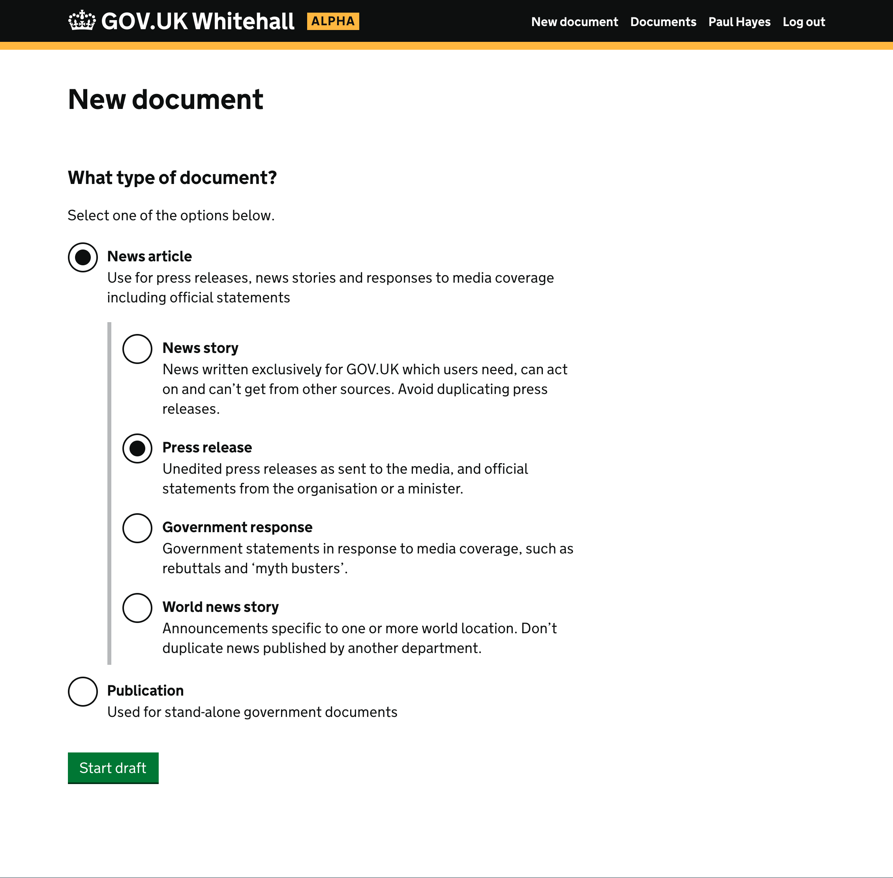
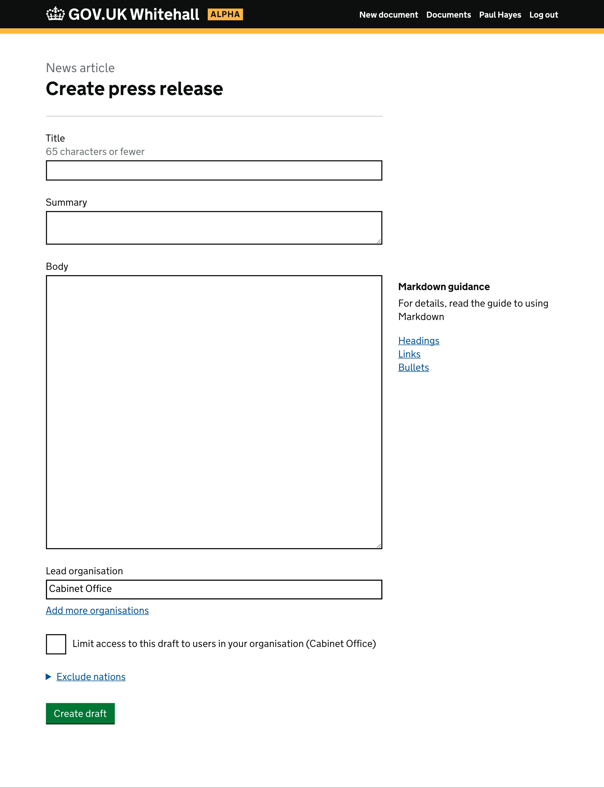
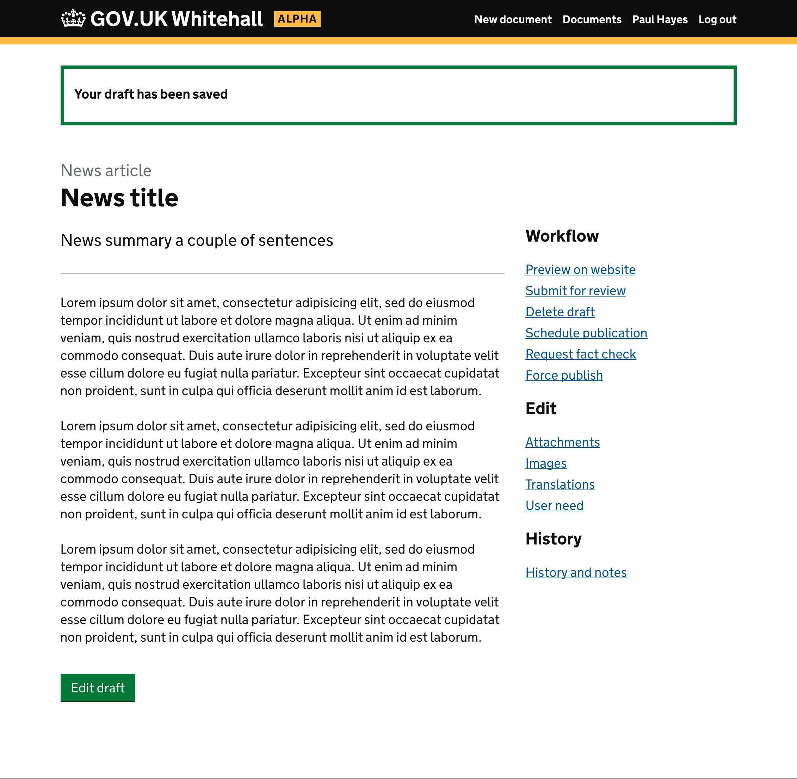
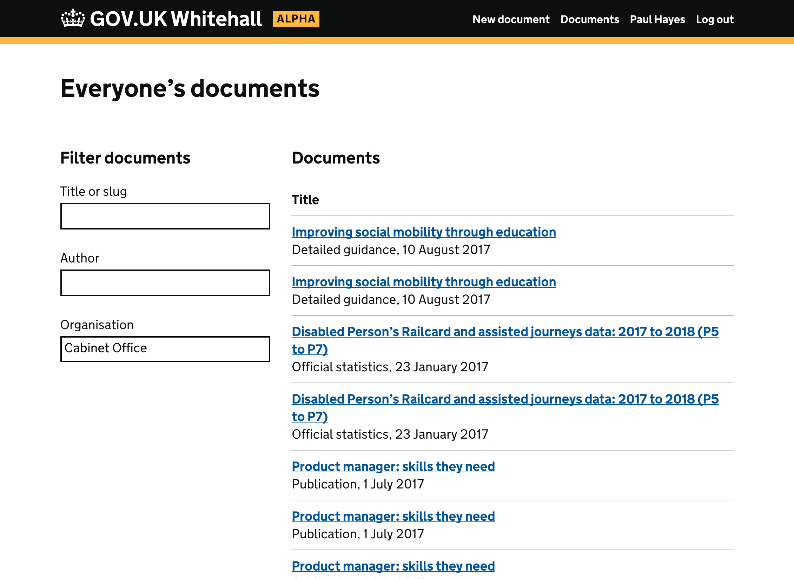

# GOV.UK Whitehall Prototype

https://whitehall-prototype.herokuapp.com

Built by the GOV.UK Publishing Workflow team using the [GOV.UK Prototype Kit](https://govuk-prototype-kit.herokuapp.com/docs).

The prototype explores existing designs and page layouts in Whitehall re-imagined using the GOV.UK design patterns.

## Running the prototype locally

```
npm install
npm start
```

## Screenshots

### Choosing a format



### Creating a news article



### News article view



### Documents


